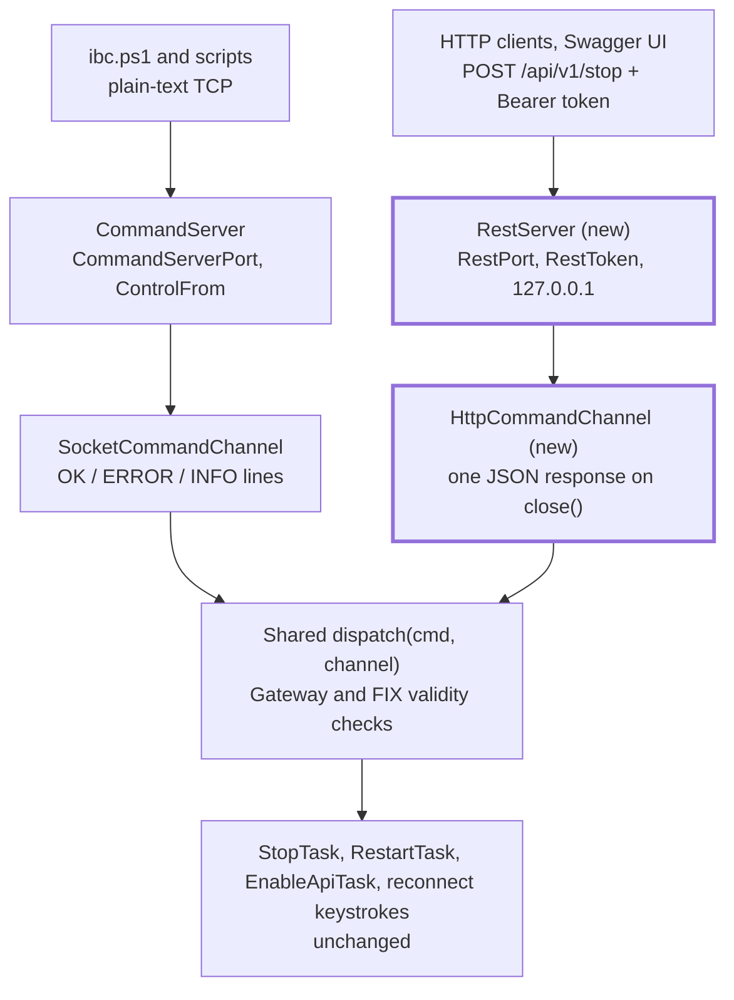

# IBC REST API — Implementation Plan

- **Date:** 2026-10-02
- **Status:** implemented on branch `feature/rest-api` (2026-10-02); not yet tested against a real TWS or Gateway. See *Decisions* below for where the implementation differs from the original proposal.

## Summary

Add an optional HTTP/JSON control API to IBC, served in-process by the JDK's built-in `com.sun.net.httpserver`, with an OpenAPI spec and a Swagger UI page. It reuses the existing command tasks, adds no dependencies, and is off unless `RestPort` is set. Estimated effort is 1.5 to 2 days, most of it testing against real TWS and Gateway.

Goals:

- Control IBC from tools that speak HTTP rather than raw TCP (schedulers, dashboards, Home Assistant, scripts using `curl` or `Invoke-RestMethod`).
- Expose status that the TCP protocol can't: session type and readiness.
- Give every action a self-describing contract (`/openapi.yaml`, `/docs`).
- Require authentication from day one, unlike the TCP command server (finding S2).

## Scope and non-goals

In scope: the six existing commands as HTTP endpoints, a `GET /status` endpoint, bearer-token auth, the OpenAPI spec and Swagger UI page, settings, and user-guide changes.

Not in scope:

- Replacing or removing the TCP command server. Both run side by side, and `ibc.ps1` keeps using TCP.
- Trading, market data or account endpoints. IBC drives the TWS GUI; it has no API access to orders or positions.
- TLS. Bind to loopback, or put a reverse proxy in front when remote access is needed.
- Fixing S1/S3 in the TCP server. They are separate items in `docs/spec/code-review-findings.md`; the REST server simply avoids the same mistakes.

## Current design

The command tasks already report everything through one class, `CommandChannel`, so a second transport only needs a second channel implementation.

| Class | Role today |
| --- | --- |
| `CommandServer` | `ServerSocket` on `CommandServerPort`; checks `ControlFrom`; hands each connection to `MyCachedThreadPool` |
| `CommandDispatcher` | Reads one line, switches on `STOP` / `RESTART` / `PAUSE` / `ENABLEAPI` / `RECONNECTDATA` / `RECONNECTACCOUNT` / `EXIT`; rejects commands invalid for Gateway or FIX |
| `CommandChannel` | `final` class around the socket: `getCommand`, `writeAck` (`OK …`), `writeNack` (`ERROR …`), `writeInfo` (`INFO …`), `close` |
| `StopTask`, `RestartTask`, `EnableApiTask` | Take a `CommandChannel`, write ack/nack/info, then call `close()` |

Two details shape the design:

- Every task calls `close()` once it has said all it will say. For `STOP` this happens before `Runtime.halt` or `File > Exit`. An HTTP channel can treat `close()` as "send the response now".
- The two reconnect commands dispatch keystrokes to the main window and ack straight away; `ENABLEAPI` blocks until the config dialog finishes.

## Proposed design

One new server class sits beside `CommandServer` and feeds the same tasks through an HTTP-backed channel.

Both transports end in the same dispatch and tasks, so behaviour stays identical whichever way a command arrives.

1. **Make the channel replaceable.** Rename the current class to `SocketCommandChannel` and introduce an abstract `CommandChannel` with `writeAck`, `writeNack`, `writeInfo`, `close`. `getCommand` and `writePrompt` stay on the socket class. The tasks keep their signatures.
2. **`HttpCommandChannel`.** Collects info lines, records the first ack or nack, and on `close()` (or when the handler returns) writes one JSON response: `{"ok": true, "message": "…", "info": […]}`. A second `close()` is a no-op.
3. **Extract the dispatch.** Move the command switch out of `CommandDispatcher.run()` into a method taking `(String cmd, CommandChannel channel)`, so the TCP and HTTP paths share the Gateway/FIX checks.
4. **`RestServer`.** Creates an `HttpServer` on `RestBindAddress:RestPort` with its own fixed pool of 4 daemon threads. Contexts: `/api/v1/*` (actions and status), `/openapi.yaml`, `/docs`. Started from `IbcTws.load()` next to `startCommandServer()`, only when `RestPort` is non-zero.
5. **Threading.** Handlers run on pool threads, never the EDT, so `getMainWindow()` and `Utils.invokeMenuItem()` keep working. The HTTP server's own threads must not be shut down by `CommandServer.shutdown()` before the response is flushed.

Request flow for `POST /api/v1/stop`: auth check → build `HttpCommandChannel` → shared dispatch → `StopTask` writes `Shutting down` → `close()` flushes `200` → TWS exits.

## API

Seven endpoints under `/api/v1`, all JSON, all needing the bearer token. Actions are `POST` only, so a stray browser `GET` can't stop TWS.

| Method | Path | Maps to | Not valid for | Returns |
| --- | --- | --- | --- | --- |
| GET | `/api/v1/status` | `SessionManager`, `LoginManager` | — | `200` mode (TWS / Gateway / FIX), login state, IBC version, ready flag |
| POST | `/api/v1/stop` | `StopTask` | — | `200` then the process exits |
| POST | `/api/v1/restart` | `RestartTask` | FIX | `202` with restart time |
| POST | `/api/v1/pause` | `RestartTask` (pause) | FIX | `202` |
| POST | `/api/v1/enableapi` | `EnableApiTask` | Gateway | `200` `configured` / `already configured` |
| POST | `/api/v1/reconnectdata` | keystroke Ctrl+Alt+F | FIX | `200` |
| POST | `/api/v1/reconnectaccount` | keystroke Ctrl+Alt+R | FIX | `200` |

Error mapping: a task's `writeNack` → `409` ("already in progress") or `422` ("not valid for the IB Gateway"); missing or wrong token → `401`; wrong method → `405`; unknown path → `404`; an exception → `500`.

**OpenAPI and Swagger UI.** A hand-written `openapi.yaml` (OpenAPI 3.1, about 150 lines) lives in `src/main/resources` and is served at `/openapi.yaml`. `/docs` serves a ~20-line HTML page that loads `swagger-ui-dist` from jsDelivr and points it at the spec. The spec declares a `bearerAuth` scheme so Swagger's Authorize button works. The `/stop`, `/restart` and `/pause` descriptions warn that "Try it out" really stops TWS. `/docs` and `/openapi.yaml` need no token: they reveal nothing that isn't in the user guide.

## Security

The REST server refuses to start without a token and listens on loopback by default. That's stricter than the TCP server on purpose: HTTP is reachable from browsers and easy to expose by accident.

- **Token.** `RestToken` must be set (at least 32 characters) or the server logs an error and stays off. Clients send `Authorization: Bearer <token>`. The comparison uses `MessageDigest.isEqual` (constant time). The token is masked in IBC's log, like the password.
- **Bind address.** `RestBindAddress` defaults to `127.0.0.1`. Binding elsewhere logs a warning that traffic, token included, is plaintext.
- **Source IP.** Reuse `ControlFrom`, matching IP literals only and treating any `isLoopbackAddress()` as local. This avoids findings S1 (DNS lookups) and S3 (`::1` rejected).
- **Browser safety.** No CORS headers, so other sites' pages can't call the API. Actions are `POST` with a required header, which a cross-site form can't send.
- **Resource limits.** Bounded executor (4 threads), request body ignored, 10-second read timeout via `sun.net.httpserver.maxReqTime`.
- **Login security.** No endpoint touches login, 2FA or security-code dialogs.

## Configuration and documentation

Three new settings in `config.ini`, next to the command server block. All are read by Java through `Settings`; `ibc.ps1` doesn't need them.

| Setting | Default | Meaning |
| --- | --- | --- |
| `RestPort` | `0` (off) | Port for the REST server. Suggested values: 7470 live, 7471 paper |
| `RestBindAddress` | `127.0.0.1` | Interface to listen on |
| `RestToken` | empty | Bearer token, 32+ characters; server stays off while empty |

Other changes:

- `docs/userguide.md`: a new "REST API" section with the settings, a `curl` and an `Invoke-RestMethod` example, and the `/docs` URL.
- `scripts/deploy.ps1`: write `RestPort` for the generated `live` / `paper` accounts, commented out, so ports don't clash.
- `docs/reference/how-ibc-works.md`: add `RestServer` and `HttpCommandChannel` to the command-server section.
- `ibc.ps1`: no change. Switching its commands to HTTP is optional and not planned.

## Implementation steps

Each step builds and leaves the TCP server working, so the work can stop after any of them. Total is about 12 to 15 hours.

| # | Step | Files | Estimate |
| --- | --- | --- | --- |
| 1 | Split `CommandChannel` into an abstract base and `SocketCommandChannel`; make `close()` idempotent | `CommandChannel.java`, new `SocketCommandChannel.java`, `CommandServer.java` | 1 h |
| 2 | Extract the command switch into a shared `dispatch(cmd, channel)` | `CommandDispatcher.java` | 1 h |
| 3 | `HttpCommandChannel`: collect ack/nack/info, map to status code + JSON | new `HttpCommandChannel.java` | 1.5 h |
| 4 | `RestServer`: settings, auth, IP filter, routes, `/status`; start from `IbcTws.load()`; mask `RestToken` in the log | new `RestServer.java`, `IbcTws.java` | 3 h |
| 5 | `openapi.yaml` + `/docs` page; resources in the jar | `src/main/resources/`, `build.gradle.kts` if needed | 2 h |
| 6 | `config.ini`, user guide, `deploy.ps1`, design reference | see previous section | 1.5 h |
| 7 | Manual testing (next section) | — | 3–4 h |

No build change is needed: IBC runs on the classpath, where `com.sun.net.httpserver` resolves without a module descriptor.

## Testing plan

There is no test suite, so every case runs by hand against a paper account, deployed with `scripts/deploy.ps1` to a scratch folder (not `C:\IBC`). Run each action case on both TWS and Gateway.

- [ ] Server stays off with `RestPort=0`, and with `RestPort` set but `RestToken` empty (error logged)
- [ ] `401` without a token, with a wrong token; `405` for `GET /api/v1/stop`; `404` for an unknown path
- [ ] Request from a non-allowed IP is refused; `::1` and `127.0.0.1` both accepted
- [ ] `GET /status` before login, during 2FA, and after the main window appears
- [ ] `POST /enableapi` on TWS → `configured`, again → `already configured`; on Gateway → `422`
- [ ] `POST /reconnectdata` and `/reconnectaccount` → `200`, TWS reconnects
- [ ] `POST /restart` → `202`, restart happens, `ibc.ps1` loop brings IBC back; second call during restart → `409`
- [ ] `POST /pause` → `PAUSE<id>` file written, IBC doesn't come back
- [ ] `POST /stop` before login (halt path) and after login (`File > Exit` path): client gets `200` before the connection drops
- [ ] TCP `ibc.ps1 stop` / `restart` still work with the REST server on
- [ ] `/docs` renders, Authorize works, "Try it out" on `/status` returns data
- [ ] Token never appears in the IBC log

## Decisions (2026-10-02)

The owner answered the open questions:

- **Ship it:** yes.
- **Token:** optional while `RestBindAddress` is a loopback address; required otherwise. Without a token, `/api` requests whose `Host` isn't a loopback name are refused (DNS-rebinding protection), and any request with a foreign `Origin` is refused in all cases.
- **restart / pause:** wait. They reply `200` once the restart has been started or scheduled, not `202` at once.
- **Swagger UI:** from the jsDelivr CDN (`swagger-ui-dist@5`).
- **Ports:** `deploy.ps1` writes `RestPort=7470` (live) and `7471` (paper) into the account config files, and appends it to existing ones that lack it.

## Risks and open questions

| Risk | Mitigation |
| --- | --- |
| A JRE without the `jdk.httpserver` module (a trimmed `JavaPath` runtime) | Checked: TWS 10.45's bundled Zulu 17.0.16 includes it. On `NoClassDefFoundError`, log and leave the REST server off; never stop IBC |
| `STOP` response lost because the JVM exits first | Flush and close the exchange inside `HttpCommandChannel.close()`, which `StopTask` calls before exiting |
| `ENABLEAPI` blocks while the config dialog runs | Keep it synchronous; document that a short client timeout may fire first |
| Token readable in `config.ini` | Same exposure as the IB password in the same file; documented |
| Swagger page needs internet in the browser | Spec is still at `/openapi.yaml` for offline tools |
| Scope creep on an archived project | Status and the six existing commands only |

Open questions for the owner:

- [ ] Ship it at all, given the project status? It's a new feature, not a fix.
- [ ] Token required, or allow no token when bound to loopback?
- [ ] `restart` and `pause`: return `202` at once (proposed), or wait for the restart to be scheduled?
- [ ] Swagger UI from a CDN (proposed) or bundled in the jar (+1.5 MB)?
- [ ] Port numbers for live and paper in `deploy.ps1`?
